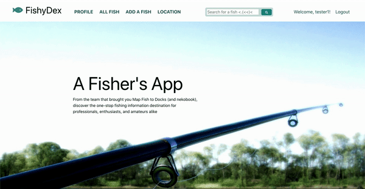
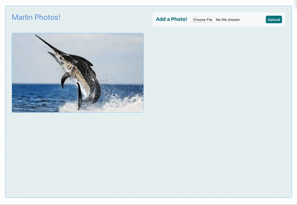

<p>A MERN stack web application geared toward fishing enthusiasts</p>

<a href="http://fishy-app.herokuapp.com/#/"> Live Demo </a>

<h2>Technologies</h2>

* Front End
  * React
  * CSS/HTML

* Back End
  * MongoDB
  * Express
  * Node.js

* Additional
  * Google Maps API
  * Amazon Web Service S3

<h2>Features</h2>

* User authentication
* Add fishes to the database (name, description, and fish legalities)

* Upload photos of fish that were caught

* View and delete photos from album


* Locations of popular fishing spots (with ability to zoom and add fishes to a specific location)
* (placeholder - TBI)
* (placeholder - TBI)

<h2>Snippets</h2>

* Implemented a search function so Users can easily look up fishes.

The below renders the box with the current input, as well as the dropdown of search suggestions.

```javascript
        return (
            <div className="search-bar">
                <input type="text" placeholder="Search for a fish <.(<<)<" value={this.state.inputVal} onChange={this.updateInput} onKeyDown={this.handleKeyDown}/>
                <button className="button" onClick={this.handleClick}><i className="fa fa-search search-bar" aria-hidden="true"></i></button>
                {
                    this.state.dropdown ?
                    (<div className="search-suggestions">
                        <ul>
                            {
                                foundNames
                            }
                        </ul>
                    </div>) : ("")
                }
            </div>
        );
    }
```

This function updates the state so that the current input is displayed in the search bar. It also shows the dropdown list of search suggestions if the user clicked into the search bar.

```javascript
updateInput(e) {
        const inputVal = e.currentTarget.value;
        this.setState({ inputVal });
        if (inputVal.trim()) {
            if (!this.state.dropdown) this.setState({dropdown: true});
        } else {
            if(this.state.dropdown) this.setState({dropdown: false});
        }
    }
```

The following snippet is for finding the subset of fish names that match what the user has typed so far - i.e. ones that start off with the same substring.
```javascript
names.forEach((name) => {
            if (name === this.state.inputVal.trim()) return;
            if (name.slice(0, that.state.inputVal.trim().length).toLowerCase() === that.state.inputVal.trim().toLowerCase()) foundNames.push(
                <Link key={name} to={`/fishes/${name.toLowerCase().split(" ").join("-")}`}>
                    <li key={name} onClick={this.hideDropdown(name)}>{name}</li>
                </Link>
            );
        });
```

handleClick and handleKeyDown are event handlers for when the user wants to choose a particular search suggestion.

```javascript
handleClick(e) {
            e.preventDefault();
            this.props.history.push(`/fishes/${this.state.inputVal.trim().toLowerCase().split(" ").join("-")}`);
            this.setState({ dropdown: false, inputVal: this.state.inputVal.trim() });
    }
    handleKeyDown(e) {
        if (this.state.inputVal.trim() && e.key === 'Enter') {
            e.preventDefault();
            this.props.history.push(`/fishes/${this.state.inputVal.trim().toLowerCase().split(" ").join("-")}`);
            this.setState({dropdown: false, inputVal: this.state.inputVal.trim()});
        }
    }
```


<h2>Maintainers</h2>
<a href="https://github.com/Sunghan11">Elijah Nam</a>
</br>
<a href="https://github.com/emikyu">Emily Wu</a>
</br>
<a href="https://github.com/joexiao97">Joe Xiao</a>
</br>
<a href="https://github.com/michaelyuen89">Michael Yuen</a>


<h2>Design Docs</h2>
<a href="https://github.com/michaelyuen89/fishyapp/wiki/Functionality-and-MVP"> Design Docs </a>
